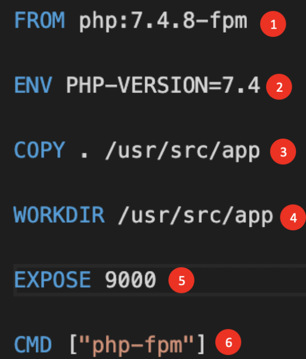

1. Traerse el repo del código para el taller:
 `git clone -b develop https://github.com/FenicioApp/taller-grupo1.git taller`{{execute}}
2. ir al repo: `cd taller`{{execute}}
3. Crear un archivo Dockerfile: `touch Dockerfile`{{execute}}
4. Abrirlo `Dockerfile`{{open}}
5. Agregarle las siguientes lineas:

	### 1.
 ### FROM
## :
indica la imagen base sobre la que se construirá la aplicación dentro del contenedor. En este caso: FROM php:7.4.8-fpm

	### 2.
 ### ENV:
 establece variables de entorno para nuestro contenedor. En este caso: ENV PHP-VERSION=7.4

	### 3.
 ### COPY
: copia archivos a un destino específico dentro del contenedor, normalmente se utiliza el . para especificar que copie todo lo que está en el directorio del Dockerfile. En este caso: COPY . /usr/src/app

	### 4.
 ### WORKDIR
: indica el path dentro del contenedor donde se va a trabajar. En este caso: WORKDIR /usr/src/app

	### 5.
 ### EXPOSE
: Informa en qué puerto el proceso que se levanta está escuchando, es a modo de documentación. En este caso: EXPOSE 9000

	### 6.
 ### CMD
: define una serie de comandos que solo se ejecutarán una vez que el contenedor se ha inicializado, pueden ser comandos Shell con parámetros establecidos. En este caso: CMD [ “php-fpm” ]

1. Guardar los cambios.

